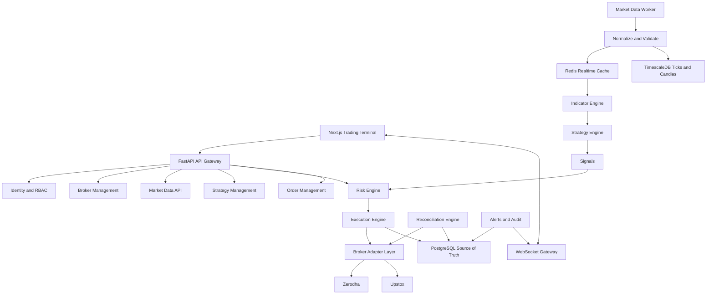

# Alpha Algo Trading System Architecture

## 1. Current Architecture Assessment

The inspected workspace is empty apart from `work/` and `outputs/`. It is not a git repository, and no application code, database migrations, tests, or documentation currently exist.

Available local tooling:

- Python 3.14.6
- Node.js 24.18.1
- npm 11.16.0
- Docker 29.7.1

Assessment:

- This is a greenfield build.
- No existing implementation conflicts were detected.
- No database state was available to inspect.
- No tests or CI configuration exist.
- The first correct step is an architecture and governance baseline, not a large unvalidated code scaffold.

## 2. Technology Decision Record

Initial stack:

- Frontend: Next.js, React, TypeScript, Tailwind CSS, shadcn/ui, TradingView Lightweight Charts.
- Backend API: Python, FastAPI, Pydantic, SQLAlchemy.
- Migrations: Alembic.
- Primary store: PostgreSQL.
- Time-series store: TimescaleDB extension on PostgreSQL.
- Realtime/cache: Redis.
- Workers: Python AsyncIO workers for market data, strategy, risk, execution, reconciliation, scheduler, and alerts.
- Infrastructure: Docker Compose, Nginx, Prometheus, Grafana, Sentry-compatible error tracking.
- CI: GitHub Actions.

Rejected for initial build:

- Kubernetes: unnecessary operational complexity at current scale.
- Kafka: not justified until volume and recovery semantics require it.
- Browser-side broker access: prohibited by security and safety requirements.
- Broker-specific strategy code: prohibited to preserve portability and auditability.

## 3. Repository Structure

Planned repository:

```text
alpha-algo-trading-system/
├── apps/
│   ├── web/
│   └── api/
├── services/
│   ├── market_data/
│   ├── trading_engine/
│   ├── strategy_engine/
│   ├── risk_engine/
│   ├── execution_engine/
│   ├── portfolio_engine/
│   ├── reconciliation_engine/
│   └── notification_engine/
├── packages/
│   ├── contracts/
│   ├── indicators/
│   ├── strategies/
│   ├── broker_adapters/
│   └── shared/
├── backtesting/
├── migrations/
├── tests/
│   ├── unit/
│   ├── integration/
│   ├── trading/
│   ├── risk/
│   ├── broker/
│   ├── backtesting/
│   └── e2e/
├── docs/
├── scripts/
├── infra/
├── docker/
├── .github/workflows/
├── .env.example
├── docker-compose.yml
├── docker-compose.dev.yml
├── docker-compose.test.yml
├── Makefile
└── README.md
```

Responsibility boundaries:

- Strategy code emits signals only.
- Risk engine decides whether an order intent may proceed.
- Execution engine is the only path to broker order submission.
- Broker adapters contain all broker-specific behavior.
- Database models are internal and must not be exposed directly as public API contracts.
- Redis is a transient state/cache layer, not the financial source of truth.

## 4. System Architecture



## 5. Market-Data Architecture

Planned data flow:

```text
Broker WebSocket
  -> Market Data Collector
  -> Broker Decoder
  -> Normalizer
  -> Validation
  -> Duplicate Detection
  -> Redis Latest-State Cache
  -> TimescaleDB Persistence
  -> Event Dispatcher
  -> Indicator Engine
  -> Strategy Engine
```

Required safety behavior:

- Reject or quarantine ticks with invalid timestamps, unknown instruments, impossible prices, or duplicate sequence IDs.
- Mark instruments stale when no valid update arrives within configured freshness limits.
- Block new live orders when required market data is stale.
- Reconnect broker streams with exponential backoff and heartbeat monitoring.

Canonical `MarketTick` contract:

```text
instrument_id
exchange
symbol
timestamp
ltp
volume
bid
ask
bid_quantity
ask_quantity
source_broker
source_sequence
received_at
```

## 6. Strategy Architecture

Strategies will implement a shared lifecycle:

```text
initialize()
on_start()
on_tick()
on_candle()
on_order_update()
on_position_update()
on_stop()
```

Strategies may:

- Read normalized market data.
- Read their own configuration and state.
- Emit structured signals.

Strategies may not:

- Access broker credentials.
- Place orders directly.
- Bypass the risk engine.
- Mutate financial source-of-truth records directly.

Every emitted signal must include strategy ID, strategy version, instrument, action, timestamp, confidence, reason, and metadata.

## 7. Risk Architecture

The risk engine is a mandatory security boundary.

Required decision output:

```text
decision: APPROVED | REJECTED
reason_code
reason
rule_id
metadata
approval_id
expires_at
```

Initial rule families:

- Global trading halt.
- Live mode enablement gate.
- Broker health.
- Market data freshness.
- Market session status.
- Instrument restrictions.
- Quantity limit.
- Position limit.
- Exposure limit.
- Daily loss limit.
- Strategy loss limit.
- Margin availability.
- Duplicate-order protection.
- Maximum simultaneous positions.

The execution engine must reject any live order intent that lacks a valid, unexpired risk approval.

## 8. Execution Architecture

Order lifecycle:

```text
Signal
  -> Risk Decision
  -> Order Intent
  -> Internal Order Created
  -> Broker Submission
  -> Broker Acknowledgement
  -> Order Events
  -> Fill / Partial Fill / Reject / Cancel
  -> Trade Records
  -> Position Update
  -> P&L Update
  -> Audit Log
```

Safety principles:

- Submitted is not filled.
- Partial fills are first-class events.
- Unknown broker state triggers reconciliation, not optimistic completion.
- Submission requests must be idempotent by client order ID.
- Live order submission is only possible from the execution engine.

## 9. Docker Architecture

Planned Compose services:

- `web`
- `api`
- `market-data`
- `trading-engine`
- `risk-engine`
- `execution-engine`
- `worker`
- `scheduler`
- `postgres`
- `redis`
- `nginx`
- `prometheus`
- `grafana`

Development target:

```bash
docker compose up
```

Critical services must expose health checks before dependent services begin trading workloads.

## 10. Complete Implementation Roadmap

Phase 0 - Foundation:

- Initialize repository.
- Add coding standards.
- Add Docker Compose foundation.
- Add `.env.example`.
- Add CI skeleton.
- Add architecture docs and governance files.

Phase 1 - Database:

- Add SQLAlchemy models.
- Add Alembic migrations.
- Add PostgreSQL and TimescaleDB schema.
- Add indexes, constraints, and immutable audit tables.

Phase 2 - Backend:

- Add FastAPI app.
- Add auth/RBAC foundations.
- Add versioned API routes.
- Add structured errors, logging, health checks, and WebSocket foundation.

Phase 3 - Market Data:

- Add broker adapter interface.
- Add normalized tick/candle contracts.
- Add Redis latest-state pipeline.
- Add stale-data and duplicate detection.

Phase 4 - Indicators and Strategies:

- Add deterministic indicator library.
- Add strategy interface and registry.
- Add signal contracts and strategy versioning.

Phase 5 - Risk Engine:

- Add risk rules and approvals.
- Add live-mode gates, circuit breakers, and trading halt.
- Add risk tests.

Phase 6 - Execution:

- Add order lifecycle.
- Add broker submission boundary.
- Add partial fill/rejection/cancel handling.
- Add position and P&L updates.

Phase 7 - Backtesting:

- Add historical simulation engine.
- Add slippage, brokerage, and metrics.
- Add backtest reports.

Phase 8 - Paper Trading:

- Add simulated execution using real market data.
- Keep paper and live ledgers separate.

Phase 9 - Frontend:

- Add professional trading terminal.
- Add dashboard, charts, strategies, orders, portfolio, risk, backtesting, journal, and system health screens.

Phase 10 - Live Trading:

- Enable only after safety gates pass.
- Add explicit confirmation flow.
- Verify kill switch, monitoring, reconciliation, and broker failure handling.

Phase 11 - Production Hardening:

- Security audit.
- Load and failure testing.
- Backup and disaster recovery.
- Operational runbooks.

