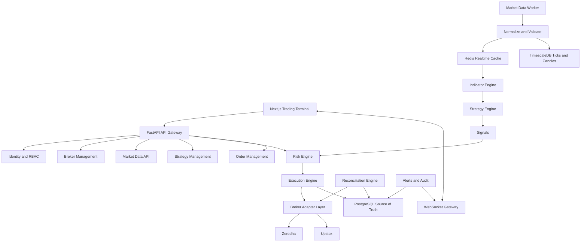

# Alpha Algo Trading System Architecture

## 1. Current Architecture Assessment

The inspected workspace is empty apart from `work/` and `outputs/`. It is not a git repository, and no application code, database migrations, tests, or documentation currently exist.

Available local tooling:

- Python 3.14.6
- Node.js 24.18.1
- npm 11.16.0
- Docker 29.7.1

Assessment:

- This is a greenfield build.
- No existing implementation conflicts were detected.
- No database state was available to inspect.
- No tests or CI configuration exist.
- The first correct step is an architecture and governance baseline, not a large unvalidated code scaffold.

## 2. Technology Decision Record

Initial stack:

- Frontend: Next.js, React, TypeScript, Tailwind CSS, shadcn/ui, TradingView Lightweight Charts.
- Backend API: Python, FastAPI, Pydantic, SQLAlchemy.
- Migrations: Alembic.
- Primary store: PostgreSQL.
- Time-series store: TimescaleDB extension on PostgreSQL.
- Realtime/cache: Redis.
- Workers: Python AsyncIO workers for market data, strategy, risk, execution, reconciliation, scheduler, and alerts.
- Infrastructure: Docker Compose, Nginx, Prometheus, Grafana, Sentry-compatible error tracking.
- CI: GitHub Actions.

Rejected for initial build:

- Kubernetes: unnecessary operational complexity at current scale.
- Kafka: not justified until volume and recovery semantics require it.
- Browser-side broker access: prohibited by security and safety requirements.
- Broker-specific strategy code: prohibited to preserve portability and auditability.

## 3. Repository Structure

Planned repository:

```text
alpha-algo-trading-system/
├── apps/
│   ├── web/
│   └── api/
├── services/
│   ├── market_data/
│   ├── trading_engine/
│   ├── strategy_engine/
│   ├── risk_engine/
│   ├── execution_engine/
│   ├── portfolio_engine/
│   ├── reconciliation_engine/
│   └── notification_engine/
├── packages/
│   ├── contracts/
│   ├── indicators/
│   ├── strategies/
│   ├── broker_adapters/
│   └── shared/
├── backtesting/
├── migrations/
├── tests/
│   ├── unit/
│   ├── integration/
│   ├── trading/
│   ├── risk/
│   ├── broker/
│   ├── backtesting/
│   └── e2e/
├── docs/
├── scripts/
├── infra/
├── docker/
├── .github/workflows/
├── .env.example
├── docker-compose.yml
├── docker-compose.dev.yml
├── docker-compose.test.yml
├── Makefile
└── README.md
```

Responsibility boundaries:

- Strategy code emits signals only.
- Risk engine decides whether an order intent may proceed.
- Execution engine is the only path to broker order submission.
- Broker adapters contain all broker-specific behavior.
- Database models are internal and must not be exposed directly as public API contracts.
- Redis is a transient state/cache layer, not the financial source of truth.

## 4. System Architecture



## 5. Market-Data Architecture

Planned data flow:

```text
Broker WebSocket
  -> Market Data Collector
  -> Broker Decoder
  -> Normalizer
  -> Validation
  -> Duplicate Detection
  -> Redis Latest-State Cache
  -> TimescaleDB Persistence
  -> Event Dispatcher
  -> Indicator Engine
  -> Strategy Engine
```

Required safety behavior:

- Reject or quarantine ticks with invalid timestamps, unknown instruments, impossible prices, or duplicate sequence IDs.
- Mark instruments stale when no valid update arrives within configured freshness limits.
- Block new live orders when required market data is stale.
- Reconnect broker streams with exponential backoff and heartbeat monitoring.

Canonical `MarketTick` contract:

```text
instrument_id
exchange
symbol
timestamp
ltp
volume
bid
ask
bid_quantity
ask_quantity
source_broker
source_sequence
received_at
```

## 6. Strategy Architecture

Strategies will implement a shared lifecycle:

```text
initialize()
on_start()
on_tick()
on_candle()
on_order_update()
on_position_update()
on_stop()
```

Strategies may:

- Read normalized market data.
- Read their own configuration and state.
- Emit structured signals.

Strategies may not:

- Access broker credentials.
- Place orders directly.
- Bypass the risk engine.
- Mutate financial source-of-truth records directly.

Every emitted signal must include strategy ID, strategy version, instrument, action, timestamp, confidence, reason, and metadata.

## 7. Risk Architecture

The risk engine is a mandatory security boundary.

Required decision output:

```text
decision: APPROVED | REJECTED
reason_code
reason
rule_id
metadata
approval_id
expires_at
```

Initial rule families:

- Global trading halt.
- Live mode enablement gate.
- Broker health.
- Market data freshness.
- Market session status.
- Instrument restrictions.
- Quantity limit.
- Position limit.
- Exposure limit.
- Daily loss limit.
- Strategy loss limit.
- Margin availability.
- Duplicate-order protection.
- Maximum simultaneous positions.

The execution engine must reject any live order intent that lacks a valid, unexpired risk approval.

## 8. Execution Architecture

Order lifecycle:

```text
Signal
  -> Risk Decision
  -> Order Intent
  -> Internal Order Created
  -> Broker Submission
  -> Broker Acknowledgement
  -> Order Events
  -> Fill / Partial Fill / Reject / Cancel
  -> Trade Records
  -> Position Update
  -> P&L Update
  -> Audit Log
```

Safety principles:

- Submitted is not filled.
- Partial fills are first-class events.
- Unknown broker state triggers reconciliation, not optimistic completion.
- Submission requests must be idempotent by client order ID.
- Live order submission is only possible from the execution engine.

## 8a. Backtesting Foundation (Phase 7, P7-001)

The deterministic backtesting foundation is implemented and verified. It is intentionally limited to history replay primitives and contains no trading semantics:

- `SimulationClock` is a pure arithmetic clock: time advances only by explicit `step` increments from an explicit `current` value. It has no wall-clock default (deliberate divergence from the injectable clock used by live-facing engines; see ADR-0006).
- BACKTEST mode is structurally isolated: `BacktestTradingMode` is a single-member enum, so no PAPER or LIVE value can be selected by a backtest session (trading rule 25).
- Inputs are explicit historical records only (`MarketCandle`/`MarketTick` from the shared contracts); no sample data is embedded anywhere in the package, and empty, unsorted, duplicated, mixed-kind, or incoherent series are rejected at construction (rules 2, 21).
- Canonical input manifests (sha256 over a repository-owned serialization) and audit records (run id, audit clock timestamp, mode, bounds, step, metadata) preserve auditability (rule 14).
- The package imports no broker adapters, execution engine, network, environment, or database code; structural tests enforce this (rules 16, 18, 24).

The backtest simulation engine (deterministic fills, slippage, commissions, and performance metrics over explicit historical inputs; see §8d and ADR-0009) is implemented and verified; it composes the P7-001 foundation and is not added to the foundation package. Backtest reports and run persistence are not implemented.

## 8b. Paper Trading Foundation (Phase 8, P8-001)

The paper trading foundation is implemented and verified. It is a PAPER-only execution simulator with no live/broker/network path (see ADR-0007):

- `PaperBrokerAdapter` implements the P3-001 `BrokerAdapter` Protocol with `supports_live_trading=False` and `supports_order_cancel=False` (v1 has no working orders). `connect` reports `authenticated=False` and never reads the credentials secret; `get_quote` and `cancel_order` fail loud.
- Fills are simulator-confirmed: `submit_order` returns ACCEPTED/REJECTED only, and any fill exists as an explicit `BrokerOrderEvent` (BROKER_ACKNOWLEDGED then FILL) that round-trips through the P6-003 `OrderExecutionState` machine to a terminal state with exact-quantity completion (rule 11; the state machine has no `SUBMISSION_REQUESTED -> FILLED` edge).
- Determinism: the injected clock is required (zero wall-clock sites in the package) and reference prices are injected, caller-owned `PaperReferencePrice` snapshots — never fetched, never defaulted, never presented as real market data (rules 2, 12). Order ids are deterministic `uuid5(broker_account_id:client_order_id)` values validated against `metadata["order_id"]`.
- Idempotency: `client_order_id` is the idempotency key; identical duplicates return the stored response with no new events, conflicting payloads raise `ClientOrderIdConflictError` (rule 13).
- Ledger separation: the paper book is append-only and sequence-numbered; positions are always `TradingMode.PAPER`-labeled (`PaperPosition` refuses any other mode), so paper and live ledgers can never mix (docs/API.md, docs/DATABASE.md).
- The package imports only broker-adapter contracts and execution-engine events; structural tests ban risk-engine, backtesting, network, environment, randomness, and persistence imports (rules 16, 18, 24, 25).

This is the foundation, not the operational paper trading feature: no P&L, slippage/commission models, market-data ingestion, persistence, reconciliation, or working-order book. Later Phase 8 tasks ("Add simulated execution using real market data") build on it; `PAPER_TRADING_VERIFIED` remains a TODO LIVE safety gate and LIVE stays disabled and unavailable.

## 8c. Paper Market-Data Feed Bridge (Phase 8, P8-002)

The paper market-data feed bridge is implemented and verified (see ADR-0008). It converts caller-supplied, already-validated `MarketTick` records (P3-002 contracts) into caller-owned `PaperReferencePrice` snapshots (P8-001) that the paper broker consumes for simulator-confirmed fills:

- Pure, stateless conversion: `tick_to_reference` maps `instrument_id -> instrument_id`, `ltp -> last`, `bid -> bid | None`, `ask -> ask | None`, `timestamp -> reference_at`. Quote legs are never synthesized from `last`; missing legs map to `None`; the fixed v1 policy is documented in the `TICK_REFERENCE_POLICY` constant (a breaking change to it is a contract change, not an implementation detail).
- Determinism: no wall-clock reads, no randomness, no state across calls; identical input yields identical output (ADR-0006/0007). `reference_at` is derived from `tick.timestamp` (tz-aware), never from `datetime.now`, never left at the epoch default.
- Fail-loud validation: non-`MarketTick` input — including `MarketCandle`, unsupported in v1 because candles carry no executable bid/ask legs (every LIMIT order would silently reject) and `close_price` is an interval aggregate, not a point-in-time last price — and incoherent ticks (`bid > ask`; `last` outside the spread when both legs are present) raise the typed `PaperFeedError`. Decimal type, finiteness, positivity, and tz-awareness are defensively re-checked at the boundary; the Infinity hole is closed at both layers (pydantic 2.13 `finite_number` at contract construction and `Decimal.is_finite()` in the feed for `model_construct` bypasses).
- Provenance: source identity never enters the snapshot; it is served by a separate frozen `TickProvenance` type whose `(source_broker, source_sequence)` pair is the P3-003 dedup key, so caller-side dedup keys identically to `alpha_algo_market_data`.
- Boundaries preserved: the package imports only `alpha_algo_contracts`, `alpha_algo_paper_trading`, and stdlib; structural tests ban network, environment, randomness, persistence, broker-adapter, execution-engine, and risk-engine imports and surface identifiers. No file under `alpha_algo_paper_trading/` was modified; fills remain decided exclusively by the P8-001 `decide_fill` path, and `PaperReferencePrice` is not re-exported by the feed.

This is a foundation bridge, not operational paper trading: no fetching/streaming/subscription, no persistence, no reconciliation, no P&L. Live market-data ingestion remains a later LIVE-gated task (`MARKET_DATA_ENABLED=false` stays); `PAPER_TRADING_VERIFIED` remains a TODO LIVE safety gate and LIVE stays disabled and unavailable.

## 8d. Backtest Simulation Engine (Phase 7, P7-002)

The backtest simulation engine is implemented and verified (see ADR-0009). It is a sibling
package (`backtesting/alpha_algo_backtest_engine/`) that composes the P7-001 foundation and
consumes caller-decided order intents:

- Determinism: fills, slippage, commissions, equity marks, and metrics are pure functions of
  the explicit historical inputs, the intents, the cost model, and initial capital. The engine
  takes no clock, reads no wall clock, uses no randomness, and performs no I/O (structural
  tests ban wall-clock/random/env/network/DB/credentials surfaces; stricter than the P7-001
  foundation's single audit-clock allowance).
- Fill timing: an intent fills at the first record strictly after its `decided_at`
  (same-record fills impossible); no record after decision = UNFILLED with an explicit reason.
- Fill policies (fixed, constant-named, auditable): tick MARKET fills at the executable side
  (BUY ask / SELL bid, `ltp` fallback only when the leg is absent — a deliberate divergence
  from P8-001's MARKET-at-last paper reference, because a backtest consuming real tick quotes
  pays the spread); tick LIMIT fills at ask/bid iff crossed, missing leg = UNFILLED (never an
  `ltp` fallback); candle fills anchor only on the next record's `open_price` (MARKET at open;
  LIMIT at open iff crossed) — no intra-bar touch modeled, `close_price` used only for the
  ex-post equity mark.
- Costs: flat `commission_per_fill` on both sides of every fill; bps slippage on MARKET fills
  only (LIMIT fills are price-capped and never slippaged). Both parameters are required at
  construction; a cost-free run is an explicit zero. No quantization in v1 — exact Decimal
  under `localcontext` precision 28.
- Ledger/metrics: FIFO lot matching with documented cost attribution; core metrics only
  (return, trade count, win rate, gross profit/loss, profit factor, max drawdown, per-period
  Sharpe); undefined ratios are `None`; metrics fail loud (`BacktestMetricsError`) when marked
  equity is non-positive. Nothing is annualized and no benchmark alpha is computed.
- Cash-account invariant: cash never goes negative (no margin, no silent quantity capping);
  SELL requires sufficient position; every refusal is an unfilled outcome with an explicit
  reason (1:1 outcomes with intents — nothing silently dropped).
- Isolation: `BacktestRun.mode` is structurally pinned to `BacktestTradingMode.BACKTEST`
  (single-member enum; the run type refuses any other value). No reports, no run persistence,
  no strategy runtime, no optimization or Monte Carlo, no portfolio/risk analytics beyond the
  core metrics, no changes to the P7-001 foundation package (walk-forward testing is a
  separate pure harness; see §8e and ADR-0010).
- Results framing: engine results are hypothetical reconstructions of the explicit historical
  inputs under documented parameterized assumptions; they imply no forward performance.
  `LIVE_TRADING_ENABLED=false` stays; all 17 LIVE safety gates remain TODO.

## 8e. Walk-Forward Testing Harness (Phase 7, P7-003)

The walk-forward testing harness is implemented and verified (see ADR-0010). It is a
sibling package (`backtesting/alpha_algo_walk_forward/`) that composes the P7-001
foundation and the P7-002 engine - never added inside either package:

- Pure scheduler + assessor: `build_windows`, `run_walk_forward`, `aggregate_periods`,
  and `assess_overfitting` are pure functions of their explicit inputs. The harness takes
  no clock, reads no wall clock, uses no randomness, performs no I/O, embeds no data, and
  persists nothing (results are in-memory and caller-owned).
- Window policy (fixed, constant-named, auditable): windows are counted in records over the
  explicit sorted history; `WalkForwardConfig` takes required-no-defaults
  `training_records`/`validation_records`/`test_records`/`step_records` with
  `step_records >= test_records` so out-of-sample windows never overlap across periods;
  slices are strictly forward, contiguous, and strictly disjoint within a window (test
  always after validation always after train); a period never observes records outside its
  slice, so no look-ahead is possible by construction; slice boundaries (`WindowSlice`:
  half-open `[start_index, end_index)` with start/end timestamps) derive from the records,
  never a clock; a trailing remainder shorter than one step is unused, never truncated,
  and visible in mandatory coverage metadata (`covered_records`/`uncovered_records`,
  `covered_records + uncovered_records == record_count` - Rule 15); too-short history
  fails loud with a typed error.
- Independent per-period results: each period's `WindowBacktestResult` is stored
  independently - its `window` (identity, harness-validated) plus `is_metrics` (a backtest
  over exactly the in-sample train ∪ validation records) and `oos_metrics` (a backtest
  over exactly the test records), both engine `BacktestMetrics` - periods are never
  blended into one run and must be ascending and gap-free.
- Runner contract: `window_runner: Callable[[WalkForwardWindow], WindowBacktestResult]` is
  caller-supplied; the harness validates the returned type, window identity, and carried
  metric values, rejects malformed results fail loud, and lets any runner exception
  propagate unchanged (no partial aggregate, nothing fabricated). The harness performs no
  strategy fitting, no signal generation, and no optimization; determinism of the whole
  run depends on the caller's runner and is documented as a caller commitment.
- Aggregation and overfitting scope: cross-window mean/median/population-stdev per core
  metric and IS-vs-OOS degradation on the five scale-free metrics, all exact Decimal under
  a fixed `localcontext` (precision 28; no `math`, no `statistics`, no float path);
  nothing annualized, no benchmark alpha. Fixed-threshold, informational `OverfittingRisk`
  flags (LOW/MEDIUM/HIGH): per-metric degradation (0.5), low OOS trade count (30),
  unrealistic OOS return (100), high period dependency (CV > 1.0); degenerate inputs (zero
  OOS trades, fewer than 3 periods) cap at LOW with explicit reasons. Flags auto-reject
  nothing and block nothing.
- Results framing: walk-forward results are hypothetical reconstructions of the explicit
  historical inputs under documented window, cost, and runner assumptions; they are not
  evidence of profitability and imply no forward performance. `LIVE_TRADING_ENABLED=false`
  stays; all 17 LIVE safety gates remain TODO.

## 8f. Backtest Performance Reports (Phase 7, P7-004)

The backtest performance report layer is implemented and verified (see ADR-0011). It is a
sibling package (`backtesting/alpha_algo_backtest_reports/`) that composes the P7-001
foundation and the P7-002 engine - never added inside either package (or the P7-003
harness):

- Pure report generator: `build_report(run, *, risk_free_rate_per_period, symbol=None,
  timeframe=None) -> BacktestReport` and `build_trade_reconstructions(run)` are pure
  functions of their explicit inputs. The layer takes no clock, reads no wall clock, uses
  no randomness, performs no I/O, embeds no data, generates no UUIDs, and persists
  nothing (a report is an in-memory, immutable value).
- Honest scope (fixed, constant-named): the report computes only what is derivable from
  `BacktestRun` + `BacktestMetrics` + the fill-sequence-to-timestamp join. The v1 engine
  is single-position, long-only, and records no symbol/signal/reason/stop/target/MFE/MAE/
  regime/short-side, so those `TradeReconstruction` fields are `None` (or documented
  not-computable) - never fabricated; `entry_label`/`exit_label` surface
  `OrderIntent.label` only. `REPORT_LIMITATIONS` is a fixed disclosure (single-instrument,
  long-only, non-annualized, no-regime, None-MFE/MAE).
- Trade reconstruction (23 fields): joins fill sequences to `FillRecord` timestamps/prices;
  `net_pnl == realized_pnl`, `fees == entry_cost + exit_cost`,
  `gross_pnl == net_pnl + fees` (self-consistent exact), `entry_slippage ==
  slippage_per_share * quantity`; `exit_slippage`/`slippage` are exact only when every
  exit fill sequence is exclusive to one trade, else `None` (pyramiding-safe).
- Extended statistics (14 fields): loss rate, expectancy, average win/loss, risk/reward,
  largest win/loss, max consecutive wins/losses, average trade duration (mean of
  max-exit-time - entry-time), recovery factor (net_profit / currency max drawdown),
  total fees, total slippage. Undefined ratios are `None` - never 0, never Infinity.
- Risk ratios (`RiskMetrics`): Sortino = (mean return - rf) / downside deviation, with
  downside deviation the population semi-deviation against a zero target; Calmar =
  non-annualized total_return / max_drawdown. Both `None` on a zero denominator. Nothing
  is annualized (consistent with the engine's per-period Sharpe).
- Curves and buckets: a peak-resetting drawdown series (ratio + dollar amount) and
  daily/monthly/yearly per-period return buckets computed from the already-marked equity
  curve; a single-point bucket reports `None` (honest, not 0).
- Precision and framing: all arithmetic is exact Decimal under a fixed `localcontext`
  (precision 28; no `math`, no `statistics`, no float path, no quantization); frozen
  dataclasses fail loud via `__post_init__`; every public docstring carries "hypothetical"
  and "not evidence of profitability". Report results are hypothetical reconstructions of
  the explicit historical inputs under documented engine and report assumptions - not
  evidence of profitability and implying no forward performance. `LIVE_TRADING_ENABLED=false`
  stays; all 17 LIVE safety gates remain TODO.

## 9. Docker Architecture

Planned Compose services:

- `web`
- `api`
- `market-data`
- `trading-engine`
- `risk-engine`
- `execution-engine`
- `worker`
- `scheduler`
- `postgres`
- `redis`
- `nginx`
- `prometheus`
- `grafana`

Development target:

```bash
docker compose up
```

Critical services must expose health checks before dependent services begin trading workloads.

## 10. Complete Implementation Roadmap

Phase 0 - Foundation:

- Initialize repository.
- Add coding standards.
- Add Docker Compose foundation.
- Add `.env.example`.
- Add CI skeleton.
- Add architecture docs and governance files.

Phase 1 - Database:

- Add SQLAlchemy models.
- Add Alembic migrations.
- Add PostgreSQL and TimescaleDB schema.
- Add indexes, constraints, and immutable audit tables.

Phase 2 - Backend:

- Add FastAPI app.
- Add auth/RBAC foundations.
- Add versioned API routes.
- Add structured errors, logging, health checks, and WebSocket foundation.

Phase 3 - Market Data:

- Add broker adapter interface.
- Add normalized tick/candle contracts.
- Add Redis latest-state pipeline.
- Add stale-data and duplicate detection.

Phase 4 - Indicators and Strategies:

- Add deterministic indicator library.
- Add strategy interface and registry.
- Add signal contracts and strategy versioning.

Phase 5 - Risk Engine:

- Add risk rules and approvals.
- Add live-mode gates, circuit breakers, and trading halt.
- Add risk tests.

Phase 6 - Execution:

- Add order lifecycle.
- Add broker submission boundary.
- Add partial fill/rejection/cancel handling.
- Add position and P&L updates.

Phase 7 - Backtesting:

- Add historical simulation engine. ✅ (P7-002)
- Add slippage, brokerage, and metrics. ✅ (P7-002)
- Add walk-forward testing (configurable windows, IS/OOS separation, informational overfitting-risk flags). ✅ (P7-003)
- Add backtest reports.

Phase 8 - Paper Trading:

- Add simulated execution using real market data.
- Keep paper and live ledgers separate.

Phase 9 - Frontend:

- Add professional trading terminal.
- Add dashboard, charts, strategies, orders, portfolio, risk, backtesting, journal, and system health screens.

Phase 10 - Live Trading:

- Enable only after safety gates pass.
- Add explicit confirmation flow.
- Verify kill switch, monitoring, reconciliation, and broker failure handling.

Phase 11 - Production Hardening:

- Security audit.
- Load and failure testing.
- Backup and disaster recovery.
- Operational runbooks.
