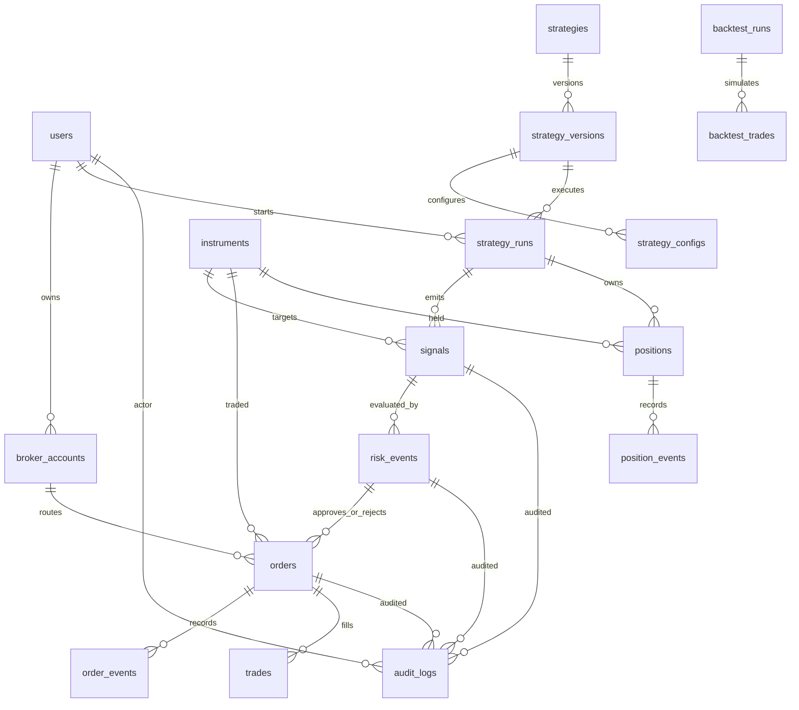

# Database Architecture

This document is a proposal. No database or migration currently exists.

## Storage Responsibilities

PostgreSQL is the source of truth for identity, broker accounts, strategies, signals, orders, trades, positions, portfolio snapshots, risk events, alerts, audit logs, and system events.

TimescaleDB stores high-volume time-series records such as ticks, candles, market depth, and indicator values.

Redis stores transient state only: latest LTP, active strategy state, realtime P&L cache, pub/sub fan-out, rate limits, distributed locks, and temporary sessions.

## Core Tables

Primary schema:

```text
users
roles
permissions
user_roles
role_permissions
broker_accounts
broker_sessions
exchanges
instruments
strategies
strategy_versions
strategy_configs
strategy_runs
signals
orders
order_events
trades
positions
position_events
portfolio_snapshots
risk_rules
risk_events
alerts
notifications
backtest_runs
backtest_trades
audit_logs
system_events
```

Timescale hypertables:

```text
ticks
candles
market_depth
indicator_values
```

## ERD Proposal



## Constraints and Safety Rules

- Orders are append-observed through `order_events`; financial history must not be silently deleted.
- Trades are created only from broker-confirmed or simulator-confirmed fills.
- Live and paper ledgers must be separated by `trading_mode`.
- Every live order must reference a valid risk decision.
- Every strategy-produced trade must retain strategy ID, version, configuration, signal, and reason.
- Broker credentials must be encrypted at rest and never exposed to the frontend.
- Unique constraints should enforce idempotency for client order IDs, broker order IDs, signal IDs, and source event IDs.

## Migration Policy

- All schema changes must be tracked through Alembic migrations.
- Production schema must not be modified manually.
- Backward-compatible migrations are preferred.
- Destructive migrations require explicit approval, backup, and rollback documentation.

